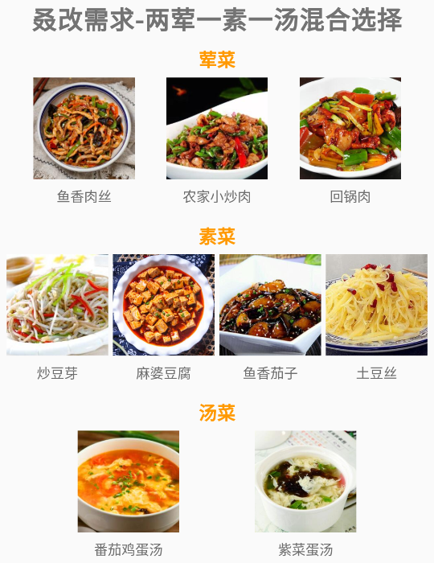

# BestChooser

## 一、前言

在Android中实现单选可以使用RadioGroup+RadioButton来实现，但它存在一些痛点：

1. RadioButton必须做为RadioGroup的直接子View才能实现单选效果，由于RadioGroup继承自LinearLayout，因此布局受到了限制
2. 为了实现UI的各种骚效果，RadioButton的定制有限，我们不得不放弃使用RadioGroup和RadioButton，转而自己来控制各个View的选择状态，很麻烦

同样的，多选也会存在着开发者自己控制各个View的选中状态，增加很多模板代码。因此**BestChooser**便出现了，意在优雅的解决以上问题。

## 二、使用

Gradle加入以下代码：

```groovy
uploading
```

在使用前，您都需要创建一个类并继承`ChooserView`，用于提供选项的布局：

```kotlin
class PayChooseView @JvmOverloads constructor(
    context: Context, attrs: AttributeSet? = null, defStyleAttr: Int = 0
) : ChooserView(context, attrs, defStyleAttr) {

    private lateinit var view: View

    override fun createView(attrs: AttributeSet?) {
        view = LayoutInflater.from(context).inflate(R.layout.view_pay_choose, this)
    }

    override fun onSelectChange(isSelect: Boolean) {
    }
}
```

强烈建议大家使用自定义属性，方便在XML中给每个选项设置不同的内容。例如，您可以在`values/attrs.xml`中声明`PayChooseView`的自定义属性：

```xml
<declare-styleable name="PayChooseView">
    <attr name="payment_image_src" format="reference" />
    <attr name="payment_name" format="string" />
</declare-styleable>
```

然后您可以在`PayChooseView#createView`中获取这些属性的值并设置给相应控件，详细代码请参考simple。`PayChooseView#onSelectChange`在控件状态改变的时候被框架调用，您可以在这个方法中处理控件选中和未选中的UI样式。

只要您继承了`ChooserView`，就会得到一个默认的自定义属性：`viewTag`，它会作为后续选中回调中的一个参数，您可以使用它来确定您正在操作的是哪个选项。

完成上述工作后，您就可以在布局中随意使用了，例如：

```xml
<TextView
    android:id="@+id/tv_single_choose"
    android:layout_width="wrap_content"
    android:layout_height="wrap_content"
    android:text="产品新需求-单选"
    android:textSize="22sp"
    android:textStyle="bold"
    app:layout_constraintEnd_toEndOf="parent"
    app:layout_constraintStart_toStartOf="parent"
    app:layout_constraintTop_toTopOf="parent" />

<com.hurryyu.bestchooser.simple.PayChooseView
    android:id="@+id/ali_pay_view"
    android:layout_width="wrap_content"
    android:layout_height="wrap_content"
    android:layout_marginTop="10dp"
    app:layout_constraintHorizontal_chainStyle="spread"
    app:layout_constraintLeft_toLeftOf="parent"
    app:layout_constraintRight_toLeftOf="@id/wechat_pay_view"
    app:layout_constraintTop_toBottomOf="@id/tv_single_choose"
    app:payment_image_src="@drawable/icon_alipay"
    app:payment_name="支付宝支付"
    app:viewTag="alipay" />

<com.hurryyu.bestchooser.simple.PayChooseView
    android:id="@+id/wechat_pay_view"
    android:layout_width="wrap_content"
    android:layout_height="wrap_content"
    app:layout_constraintLeft_toRightOf="@id/ali_pay_view"
    app:layout_constraintRight_toRightOf="parent"
    app:layout_constraintTop_toTopOf="@id/ali_pay_view"
    app:payment_image_src="@drawable/icon_wechat_pay"
    app:payment_name="微信支付"
    app:viewTag="wxpay" />

<com.hurryyu.bestchooser.simple.PayChooseView
    android:id="@+id/union_pay_view"
    android:layout_width="wrap_content"
    android:layout_height="wrap_content"
    android:layout_marginTop="10dp"
    app:layout_constraintLeft_toLeftOf="parent"
    app:layout_constraintRight_toRightOf="parent"
    app:layout_constraintTop_toBottomOf="@id/ali_pay_view"
    app:payment_image_src="@drawable/icon_union_pay"
    app:payment_name="银联支付"
    app:viewTag="unionpay" />
```

您将得到如下布局：


三个选项的位置可以任意摆放，摆脱了RadioGruop的限制。不过现在它们并不能正常工作，因为本框架提供的功能并非只有单选，因此您需要通过简单的kotlin或java代码来进行设置：

### 2.1、单选

您只需要在Activity或是Fragment中通过`findViewById`找到各个选项，将它们告诉框架即可：

```kotlin
val singleChooserManager = ChooserViewGroupManager.Builder()
    .addChooserView(chooserView = *arrayOf(ali_pay_view, wechat_pay_view, 
                                           union_pay_view))
    .build()
```

这样，三个选项之间便可以实现单选效果了：


您可能希望框架能在选项被选中时通知您，您可以为刚刚创建出的`ChooserViewGroupManager`加一个监听器：

```kotlin
singleChooserManager.setOnChooseChangeListener(object : OnChooseChangeListener() {
    override fun onChanged(
        chooserView: ChooserView,
        viewTag: String,
        groupTag: String,
        isSelected: Boolean
    ) {
    	Toast.makeText(this@MainActivity, viewTag, Toast.LENGTH_SHORT).show()
    }
})
```

在回调中，`viewTag`是您在XML中为每个选项设置的独一无二的值，您可以用它来得知用户操作的是哪个选项；`groupTag`用于标识用户操作的选项属于哪个分组，如果您在添加选项时没有显式指定，它的默认值为`default_group_tag`。

### 2.2、多选

如果您希望上面的3个选项是多选，您仅需给它设置一个多选的Mode即可：

```kotlin
val singleChooserManager = ChooserViewGroupManager.Builder(ChooserMode.MODE_MULTIPLE)
    .addChooserView(chooserView = *arrayOf(ali_pay_view, wechat_pay_view, 
                                           union_pay_view))
    .build()
```

对比上面单选的代码，您仅仅只增加了`ChooserMode.MODE_MULTIPLE`。如果您希望控制多选的最大选中数量，您可以通过`allGroupMaxCount(int)`来设置：

```kotlin
val singleChooserManager = ChooserViewGroupManager.Builder(ChooserMode.MODE_MULTIPLE)
    .addChooserView(chooserView = *arrayOf(ali_pay_view, wechat_pay_view, 
                                           union_pay_view))
	// 您只需新增↓
    .allGroupMaxCount(2)
    .build()
```

如果您希望达到多选上限后用户继续选中选项能收到回调，您只需重写`reachTheUpperLimit(groupTag: String, limit: Int)`方法：

```kotlin
singleChooserManager.setOnChooseChangeListener(object : OnChooseChangeListener() {
    override fun onChanged(
        chooserView: ChooserView,
        viewTag: String,
        groupTag: String,
        isSelected: Boolean
    ) {
    	Toast.makeText(this@MainActivity, viewTag, Toast.LENGTH_SHORT).show()
    }
    
    // 您只需新增↓
    override fun reachTheUpperLimit(groupTag: String, limit: Int) {
    	Toast.makeText(this@MainActivity, "达到上限:$limit", Toast.LENGTH_SHORT).show()
    }
})
```

### 2.3、混合单、多选

如果您遇到这样一个需求：展示一个菜单，用户最多从荤菜中选择两道菜，从素菜中选择一道菜，从汤菜中选择一道菜。这里涉及到荤菜是多选，不能超过2个，素菜和汤菜都是单选。我们可以使用前面介绍的知识轻松完成整个选项的布局：



布局代码就不在此过多赘述，大家可以自行查看simple。我们可以将荤菜、素菜、汤菜分为3个不同的Group，由于两个Group都是单选，因此我们可以将框架的默认选择模式设置为单选（Builder不传参，默认是单选），单独设置荤菜这个Group为多选，且上限为2。代码如下：

```kotlin
val menuChooserManager = ChooserViewGroupManager.Builder()
	// 荤菜Group
    .addChooserView("meatGroup", yuxiangrousi_view, xiaochaorou_view, huiguorou_view)
    // 素菜Group
    .addChooserView(
        "vegetable",
        douya_view,
        mapodoufu_view,
        yuxiangqiezi_view,
        tudousi_view
    )
    // 汤菜Group
    .addChooserView("soup", fanqiejidantang_view, zicaidantang_view)
    // 单独设置荤菜这个Group为多选,且上限为2
    .chooserModeByGroupTag("meatGroup", ChooserMode.MODE_MULTIPLE, 2)
    .build()
```

您仅需通过以上简单的代码，就可以实现这个功能。

## 三、谢谢

首先我要感谢[Selector](https://github.com/wisdomtl/Selector)框架为我编写此框架带来了灵感与帮助，谢谢！

如果您觉得本框架对您有所帮助，欢迎您点击Start

如果您在使用过程中有任何疑问，都可以与我取得联系：

QQ:1037914505

Email:cqbbyzh@gmail.com